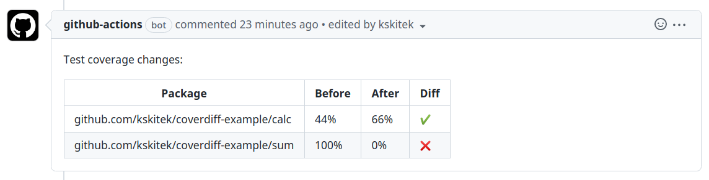
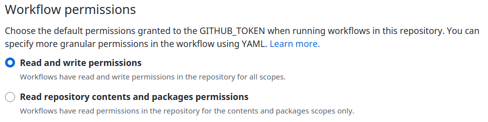

# Coverdiff Github Action

This action generates Golang test coverage profile for the PR branch and the base branch, compares results and leaves the coverage difference summary comment in the PR.

Action that adds test coverage comment in a PR:

```yaml
name: Test coverage report
concurrency:
  cancel-in-progress: true
  group: coverdiff-${{ github.ref }}

on: [pull_request]

permissions:
  contents: read
  pull-requests: write

jobs:
  main:
    name: Coverage
    runs-on: ubuntu-latest
    steps:
    - name: Go cover diff
      uses: kskitek/coverdiff@v0.3.0
```

See [test repository with examples](https://github.com/kskitek/coverdiff-example/pull/2)



## Permissions / Troubleshooting

You might stumble upon an error `Resource not accessible by integration`, in case that happens, fix GHA permissions.

Because default permissions are read only and the commenter action needs write permissions to PRs. you have to either:

- Set workflow permissions in github repository settings under `Actions/General` to allow all more permissive permissions


- Set more granular permissions using YAML. [Learn more](https://docs.github.com/en/actions/security-guides/automatic-token-authentication#modifying-the-permissions-for-the-github_token). Example:
```yaml
permissions:
  contents: read
  pull-requests: write
```

- Use `GITHUB_TOKEN` env with Personal Access Token - probably ok'ish solution only in one-man projects but consult GH documentation first.

## Special thanks

to the maintainers of [thollander/actions-comment-pull-request](https://github.com/thollander/actions-comment-pull-request) for full featured comment action!
